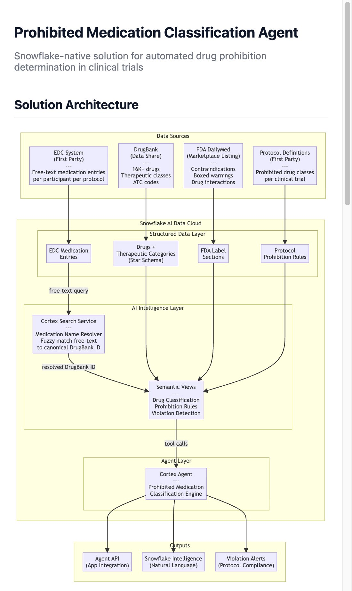

# Prohibited Medication Classification Agent

Snowflake-native solution for automated drug prohibition determination in clinical trials. Uses Cortex Search for fuzzy medication name resolution, Semantic Views for business logic encoding, and a Cortex Agent for natural language query handling.

## Solution Architecture



> For the interactive version with ER diagrams and query flow details, open [`architecture.html`](architecture.html) in a browser.

## How It Works

A site coordinator types a medication into the EDC system (e.g., "lipitor 20mg po qd"). The agent determines whether that drug is prohibited in the participant's clinical trial protocol:

1. **Resolve Name** — Cortex Search fuzzy-matches the free-text entry to a canonical DrugBank ID (e.g., "Lipitor" → DB00439, Atorvastatin)
2. **Classify Drug** — SQL join maps the drug to its therapeutic category (e.g., HMG-CoA Reductase Inhibitors / Statins)
3. **Check Rules** — SQL join checks whether that category is prohibited in the specified protocol
4. **Return Answer** — Agent responds with determination, reasoning, severity level, and any exception criteria

## Data Sources

| Source | Type | Contains |
|--------|------|----------|
| DrugBank | Data Share | 16K+ drugs, therapeutic classes, ATC codes, drug interactions |
| FDA DailyMed | Marketplace Listing | Contraindications, boxed warnings, drug label sections |
| EDC System | First Party | Free-text medication entries per participant per protocol |
| Protocol Definitions | First Party | Prohibited drug classes per clinical trial |

## Key Design Decisions

- **No graph database required** — Drug-to-prohibition traversal is 2-3 SQL joins (drug → category → protocol rule). Neo4j adds value at 10+ hops; this use case doesn't need it.
- **No external MCP dependency** — All data and compute runs inside Snowflake. No production dependency on external services.
- **AI-powered name resolution** — Cortex Search handles brand names, abbreviations, and misspellings (~100ms latency, deterministic for known synonyms).
- **Declarative prohibition rules** — New protocol? Add rows to `PROTOCOL_PROHIBITED_CLASSES`. No code changes.
- **Always-current reference data** — DrugBank via live data share, FDA via marketplace listing. Zero ETL.
- **Governance preserved** — Snowflake RBAC, masking policies, and row access policies apply through the agent layer.

## Data Model

```
DRUGS (drugbank_id, name, description, cas_number)
  └── DRUG_CATEGORIZATIONS (drug_id, category_id)
        └── CATEGORIES (category_id, title, categorization_kind, atc_code)
              └── PROTOCOL_PROHIBITED_CLASSES (protocol_id, category_id, prohibition_reason, severity, exception_criteria)
                    └── CLINICAL_PROTOCOLS (protocol_id, protocol_name, therapeutic_area, phase)

DRUG_SYNONYMS (drugbank_id, synonym, synonym_type)  ← feeds Cortex Search index
PRODUCTS (product_id, name, ndc_code, drug_id)
FDA_DRUG_LABELS (label_id, drug_id, section_type, section_text)
EDC_MEDICATIONS (entry_id, protocol_id, participant_id, medication_text, dose, frequency)
```

## Example Queries

```
"Is Eliquis prohibited in Protocol MPC-ONC-001?"
→ YES — Anticoagulants are absolutely prohibited (bleeding risk with chemo)

"Is Tylenol allowed in MPC-CARD-002?"
→ YES — Analgesics/Antipyretics are not in the prohibited class list

"Check participant SUBJ-1042's medications in MPC-CNS-003"
→ VIOLATION: Zoloft (Sertraline) is an SSRI, absolutely prohibited (serotonergic interference)
  Acetaminophen and multivitamin: ALLOWED

"What are the exception criteria for antiplatelets in MPC-CARD-002?"
→ CONDITIONAL: Low-dose aspirin (≤81mg) for cardiac prophylaxis may be allowed with PI approval
```

## Project Structure

```
├── architecture.html          # Interactive architecture diagram (open in browser)
├── docs/
│   └── architecture-screenshot.jpg
└── README.md
```

## Getting Started

_Implementation in progress — synthetic DrugBank-schema tables, FDA label data, Cortex Search service, Semantic Views, and Cortex Agent will be deployed to Snowflake._

---

Built with [Cortex Code](https://docs.snowflake.com/en/user-guide/cortex-code/cortex-code) on Snowflake AI Data Cloud.
